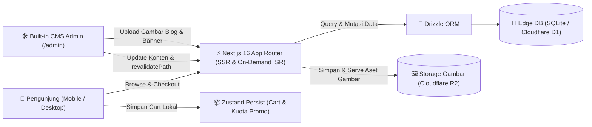
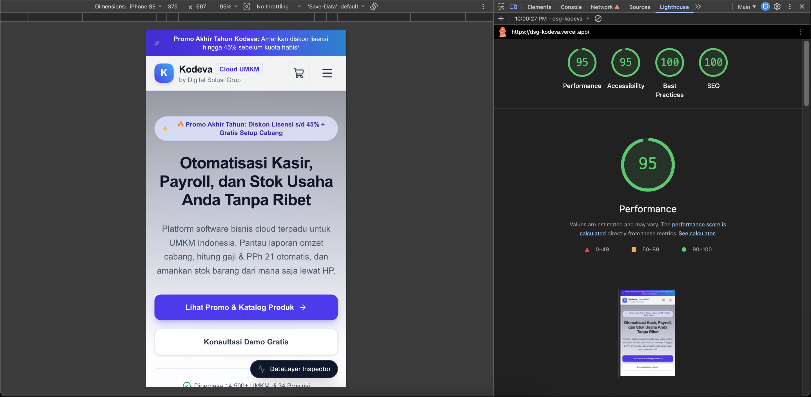
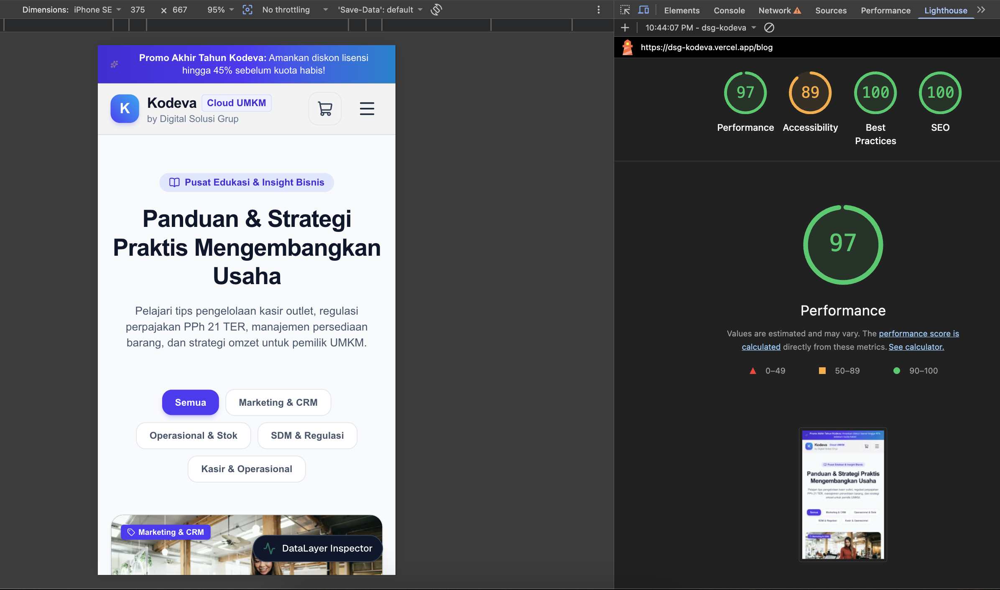
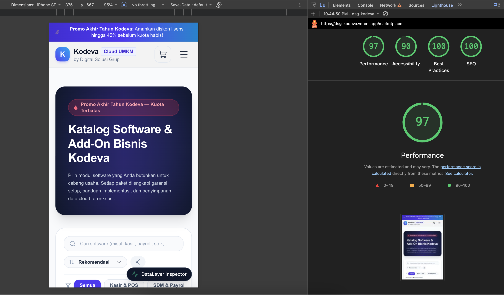

# Kodeva — Take-Home Technical Test (Fullstack Developer DSG)

Aplikasi web landing page promosi, sistem blog dengan CMS mandiri (_Built-in Edge CMS_), dan mini marketplace software bisnis berbasis lisensi berlangganan untuk brand fiktif **Kodeva** (produk PT Digital Solusi Grup).

---

## ⏱️ Waktu Pengerjaan Sebenarnya

- **Total Durasi:** ~8+ jam kerja aktif.
- **Rincian:**
  - Analisis brief, pemodelan domain, dan keputusan arsitektur stack
  - Setup Next.js 16, Drizzle ORM, Edge SQLite / Cloudflare D1-ready schema
  - Landing page, anti-spam lead capture API, dan blog dengan CMS dinamis
  - Mini marketplace (katalog 6 produk, detail switcher paket, keranjang kuota promo bersama, checkout simulasi)
  - Tracking GA4 dataLayer deduplication, first-touch UTM attribution, & floating inspector
  - Built-in Admin CMS dashboard (`/admin`), pengujian build, dan penulisan dokumentasit
  - Deployment ke Vercel / Cloudflare & verifikasi live production environment
  - Check, test dan improve fitur dan codebase setelah deploy

---

## 🚀 Cara Menjalankan Project di Lokal

### Prasyarat:

- Node.js v18.x atau lebih baru (rekomendasi Node.js v20+)
- npm

### Langkah Menjalankan:

1. **Clone repository & install dependencies:**

   ```bash
   git clone <repo-url>
   cd dsg
   npm install
   ```

2. **Jalankan server development:**

   ```bash
   npm run dev
   ```

   Buka browser di `http://localhost:3000`.

   > **Zero Setup Lokal:** Project menggunakan _smart hybrid storage_. Di lokal, sistem otomatis menggunakan SQLite lokal (`/tmp/kodeva-edge-cms.db`) dan menginisialisasi seluruh data demo (konten beranda & artikel blog) secara otomatis tanpa perlu setup database eksternal.

3. **Menjalankan Production Build:**
   ```bash
   npm run build
   npm run start
   ```

---

## 🏛️ Arsitektur Singkat & Alasan Pemilihan Stack

### 📐 Arsitektur Sistem Singkat



- **Client & Presentation:** Next.js App Router (SSR/SSG untuk SEO maksimal) + Tailwind CSS v4 mobile-first. State keranjang dan simulasi kuota promo dikelola di client via Zustand (`persist` `localStorage`).
- **Data & Storage Layer:** Built-in headless CMS internal pada rute `/admin` tanpa ketergantungan pihak ketiga. Data teks tersimpan di SQLite / Cloudflare D1 via Drizzle ORM, sedangkan berkas media/gambar di-upload dan disimpan ke Object Storage (Cloudflare R2).
- **Caching & On-Demand Invalidation:** Perubahan konten beranda atau artikel blog di admin memicu `revalidatePath()` instan ke cache edge Next.js tanpa redeploy manual.

### 🛠️ Alasan Pemilihan Stack

| Layer / Fitur        | Stack yang Dipilih                      | Alasan & Keputusan Teknis                                                                                                                                                                                           |
| :------------------- | :-------------------------------------- | :------------------------------------------------------------------------------------------------------------------------------------------------------------------------------------------------------------------ |
| **Framework Utama**  | **Next.js 16 (App Router, TypeScript)** | Memaksimalkan SEO Google untuk pencarian dengan memanfaatkan fitur Next.js seperti ISG/SSR/SSG. Link preview WhatsApp dinamis via OpenGraph metadata. Performa mobile tinggi dengan optimasi `<Image />` WebP/AVIF. |
| **Sistem CMS**       | **Built-in Edge CMS (Drizzle ORM)**     | **Menghindari vendor lock-in SaaS CMS.** CMS dibuat langsung di dalam aplikasi (rute `/admin`), dan menggunakan engine dari **Cloudflare D1** (database SQLite edge) dan **Cloudflare R2** (object storage gambar). |
| **Penyimpanan Data** | **SQLite / LibSQL (Drizzle ORM)**       | Skema Drizzle yang seragam untuk tabel `leads`, `landing_content`, dan `blog_posts`. Ringan, cepat, zero-config di lokal, dan _drop-in compatible_ ke Cloudflare D1 di production.                                  |
| **State Management** | **Zustand (`persist` middleware)**      | Dipilih karena simple, ringan (<1KB, tidak membebani First Load JS mobile). Menggunakan `localStorage` persistence agar isi keranjang dan kuota promo tidak hilang saat halaman di-refresh.                         |
| **Styling & UI**     | **Tailwind CSS v4 + Lucide Icons**      | Zero runtime CSS overhead, layout mobile-first yang responsif                                                                                                                                                       |
| **Form & Validasi**  | **Zod + React Hook Form**               | Untuk mendapatkan type-safety, validasi skema, seperti proteksi honeypot anti-bot, dan pencegahan spam pengisian kilat bot.                                                                                         |

---

## 💡 Asumsi yang Dibuat Atas Hal yang Ambigu

1. **Rencana Ekspansi Malaysia & Singapura:**
   - _Ambiguitas:_ Apakah sistem harus sudah langsung multi-mata uang (MYR/SGD) dan multi-bahasa saat ini?
   - _Asumsi:_ Untuk peluncuran kampanye akhir tahun di Indonesia, basis mata uang utama saat ini adalah IDR. Namun, fungsi kalkulasi harga dan formatting dibuat modular (`formatIDR`), dan skema database artikel siap diekstensi dengan kolom `locale` (`id`, `ms`, `en`) tanpa perlu migrasi ulang tabel.
2. **Aturan Batas Kuota Promo Bersama Lintas Tier (_Shared Quota Pool_):**
   - _Ambiguitas:_ Bagaimana kuota promo bekerja bila produk memiliki 3 opsi tier (Starter, Pro, Business)?
   - _Asumsi:_ Kuota promo dihitung sebagai **satu pool unit global per produk**. Contoh: Jika "Kodeva POS Kasir" memiliki sisa kuota promo 5 lisensi, maka pembelian 3 lisensi Starter + 2 lisensi Pro langsung menghabiskan kuota promo produk tersebut menjadi 0. Penambahan berikutnya otomatis dikunci oleh sistem keranjang belanja.
3. **Kami perlu tahu berapa orang yang klik tombol beli dari landing page.**
   - Asumsinya menggunakan event tracking seperti Google Analytics, Posthog, dsb untuk melacak/mengetahui jumlah berapa orang yg sudah klik tombol beli atau melacak jumlah klik pada suatu action. Namun, untuk technical test ini saya tidak memasang Google Analytics nya untuk kesederhanaan, tapi gantinya saya sudah menyiapkan pipeline data yg valid di _window.dataLayer_ untuk nantinya dihubungkan/diganti dengan event tracking aslinya seperti GA4. Dan untuk simulasi juga sudah dibuatkan floating box di kanan bawah untuk melacak/melihat event yg sudah di track ketika user melakukan suatu "action".

---

## 📊 Status Fitur & Rencana Pengembangan

### Yang Sudah Selesai (100% Requirement Utama):

- [x] **Landing Page Marketing:** Hero section dengan CTA terukur, highlight produk unggulan promo, testimoni pengusaha riil, FAQ interaktif, dan form lead capture dengan proteksi honeypot anti-spam.
- [x] **Blog CMS Dinamis:** Halaman daftar artikel dengan filter kategori dan pagination; halaman detail artikel dengan URL slug SEO-friendly dan kartu rekomendasi produk marketplace yang tertaut.
- [x] **Mini Marketplace:** Katalog 6 produk lengkap dengan filter kategori, detail produk dengan switch tier paket yang mengubah harga secara realtime, keranjang belanja persisten saat refresh.
- [x] **Validasi Kuota Promo Bersama:** Sistem menghitung total lisensi produk di seluruh baris keranjang sebelum mengizinkan penambahan kuota.
- [x] **Checkout Simulasi:** Validasi data pembeli, ringkasan pesanan, simulasi pembayaran sukses (dengan faktur & kunci lisensi `KDV-XXX-XXXX`) dan simulasi pembayaran gagal dengan copy realistis.
- [x] **Marketing Tracking & UTM:**
  - Parameter UTM dari link TikTok/Instagram tersimpan otomatis di storage (_first-touch attribution_) dan terbawa ke lead form maupun payload checkout order.
  - Event GA4 `view_item`, `add_to_cart`, `begin_checkout`, `purchase`, dan `click_cta` terkirim ke `window.dataLayer`.
  - Dilengkapi pencegah duplikasi (_deduplication ref guard_) agar event tidak terkirim ganda saat komponen re-render.
  - **Fitur Khusus Reviewer:** Widget _DataLayer Inspector_ melayang di pojok kanan bawah untuk memverifikasi payload UTM & event secara visual.
- [x] **Portal Admin & Built-in CMS (`/admin`):**
  - **Tab 1 (Editor Beranda):** Edit headline hero, promo badge, FAQ, dan testimoni secara visual. Tombol simpan langsung memicu revalidasi seketika.
  - **Tab 2 (Manajemen Blog):** Tambah & edit artikel, ganti status (Draft / Published), kategori, dan tautan produk marketplace.
  - **Tab 3 (Database Leads):** Tabel prospek lengkap dengan parameter UTM kampanye TikTok dan Instagram.
  - **Login Demo:** Dilengkapi fitur 1-klik masuk untuk reviewer (`admin@kodeva.com` / `admin123`).
- [x] **Caching & On-Demand Revalidation (`/api/revalidate`):** Endpoint untuk purge cache instan (`revalidatePath`) saat konten di-publish tanpa redeploy manual.

### 🎁 Fitur Bonus (Opsional) yang Sudah Diimplementasikan:

- [x] **Katalog Shareable (URL Query Sync):** Pencarian instan kata kunci (`q`), pengurutan harga (`sort=price_asc/price_desc/discount`), dan filter kategori yang tersinkronisasi realtime ke URL (`/marketplace?category=...&sort=...&q=...`) sehingga tautan pencarian siap dibagikan langsung.
- [x] **Pilihan Durasi Langganan & Tabel Komparasi:** Switcher durasi tagihan **Bulanan vs Tahunan (Hemat 20%)** di halaman detail produk, serta **Tabel Matriks Perbandingan Fitur** lengkap lintas tier paket (Starter, Pro, Business).
- [x] **Sistem Kode Voucher Promo:** Input voucher di keranjang & checkout (`DSGHEMAT`, `KODEVABARU`, `PROMOAKHIRTAHUN`) dengan validasi minimal belanja, kuota pemakaian, dan batas pemotongan harga maksimal.
- [x] **Test Otomatis Logika Inti (`npm test`):** 15 automated unit tests bawaan Node.js test runner untuk memverifikasi logika batas kuota promo bersama, kalkulasi tagihan tahunan, validasi voucher, dan penjadwalan konten promo.
- [x] **Preview / Draft Konten CMS:** Kontrol status `Draft` vs `Published` pada artikel blog di `/admin` dengan tautan preview langsung ke halaman web publik.
- [x] **Penjadwalan Konten Promo Otomatis dari CMS:** Tim marketing dapat mengatur tanggal mulai dan tanggal selesai promo dari CMS `/admin`. Badge dan banner promo otomatis tayang saat periode aktif dan otomatis beralih ke teks default saat kedaluwarsa tanpa perlu bantuan developer.

### Yang Belum Selesai/Dikerjakan

- Pengaturan layout dan urutan section landing page dari CMS (Bonus/Opsional)

### Rencana Jika Ada Waktu 1 Minggu Lagi:

1. **Multi-Region & Internationalization (i18n):** Integrasi Next-intl untuk routing `/id`, `/my`, dan `/sg` dengan switcher mata uang IDR/MYR/SGD.
2. **Payment Gateway Produksi:** Menambahkan Integrasi webhook Payment Gateway (Midtrans, Xendit, dsb) dengan Core API
3. **Automated Testing Suite:** End-to-end testing menggunakan Playwright untuk alur belanja dan Vitest untuk unit test invariant kuota promo.
4. **Fitur Bonus CMS:** Fitur drag-and-drop reorder section landing page secara visual.
5. **Improve Codebase, UI/UX & Arstitektur**: Implementasi bagian yang belum seperti menambahkan event tracking, improve UI/UX di dashboard admin.
6. **Auth**: Menggunakan auth yg lebih proper untuk login di halaman admin menggunakan Better Auth dengan Provider Username/Password dan Google Login agar memudahkan pengguna untuk masuk ke halaman admin.
7. **Real Katalog/Produk Marketplace**: Integrasi data katalog di marketplace dengan data real yang ada di database

---

## ⚡ Strategi Caching & Revalidation Konten CMS

Untuk memenuhi requirement perubahan konten tanpa deploy ulang manual:

1. **Mekanisme yang Digunakan:** **On-Demand Path Revalidation** via Next.js `revalidatePath()`.
2. **Alur Kerja:**
   - Fetching data di Server Component di-render cepat dari cache.
   - Saat admin mengedit konten di `/admin` (misal mengubah teks hero atau mempublikasikan artikel blog baru) dan menekan tombol **"Simpan Perubahan"**, Server Action / API Handler mengeksekusi `revalidatePath('/')` dan `revalidatePath('/blog')`.
3. **Konsekuensi terhadap Latensi/Kecepatan:**
   - **Instan (Sub-detik):** Perubahan langsung terlihat seketika oleh pengunjung berikutnya tanpa jeda antrean cache waktu.
   - **Performa Maksimal:** Halaman tetap di-serve dari CDN cache dengan kecepatan static HTML tanpa perlu build atau deploy ulang aplikasi secara manual.

---

## 🔒 Rencana Menghubungkan Marketplace ke Backend Produksi

Berikut spesifikasi teknis untuk implementasi tahap backend produksi:

### 1. Endpoint API yang Dibutuhkan

- `POST /api/v1/orders/create` — Membuat draft order, mencatat data pembeli, rincian tier lisensi, dan mengunci kuota sementara (_hold reservation_ 15 menit).
- `POST /api/v1/payments/charge` — Menginisialisasi transaksi ke payment gateway (menerbitkan QRIS dinamis atau nomor Virtual Account).
- `POST /api/v1/payments/webhook` — Endpoint publik penerima notifikasi status pembayaran dari payment gateway.
- `GET /api/v1/orders/:orderId/status` — Polling status pembayaran dari frontend checkout.
- `GET /api/v1/licenses/my-licenses` — Mengambil daftar kunci lisensi yang berhasil dibeli.

### 2. Alur Payment Gateway yang Aman

1. **Verifikasi Signature & Keamanan Webhook:**
   - Setiap payload webhook diverifikasi menggunakan tanda tangan digital:  
     `HMAC_SHA512(webhook_body, PAYMENT_GATEWAY_SERVER_KEY) === req.headers['x-callback-signature']`.
   - Request dengan signature tidak valid atau timestamp kedaluwarsa (>5 menit) langsung ditolak dengan status `401 Unauthorized`.
2. **Idempotensi Transaksi:**
   - Payload webhook mencantumkan `transaction_id`. Backend mencatat log webhook di tabel `payment_webhook_logs`.
   - Jika notifikasi dikirim ulang oleh payment gateway (retry mechanism), backend mendeteksi status transaksi yang sudah `PAID` dan tidak memproses pemotongan kuota atau pengiriman lisensi untuk kedua kalinya.
3. **Order State Machine:**
   - `PENDING` ➔ `PAID` ➔ `LICENSE_ISSUED` (Alur Sukses)
   - `PENDING` ➔ `EXPIRED` / `FAILED` ➔ `QUOTA_RELEASED` (Alur Gagal / Kedaluwarsa)

### 3. Cara Menjaga Kuota Lisensi Promo Tetap Akurat (_Race Condition Protection_)

- **Masalah:** Ketika sisa kuota promo tinggal 1 lisensi, namun ada 50 user mengklik bayar secara bersamaan.
- **Solusi di Database:**
  1. **Atomic Stock Decrement dengan Pessimistic Lock:**
     ```sql
     BEGIN TRANSACTION;
     SELECT remaining_promo_quota FROM products WHERE id = 'prod-pos-01' FOR UPDATE;
     -- Validasi kuota mencukupi
     UPDATE products
     SET remaining_promo_quota = remaining_promo_quota - 1
     WHERE id = 'prod-pos-01' AND remaining_promo_quota >= 1;
     COMMIT;
     ```
  2. **Distributed Lock (Redis / Redlock):**
     Sebelum membuat pembayaran, backend mengambil lock sementara: `SET lock:quota:prod-pos-01 "holder" EX 15 NX`. Jika lock berhasil, kuota promo di-reserve.
  3. **Auto-Rollback:** Jika order kedaluwarsa (user tidak membayar dalam 15 menit), cron job / Redis key expiry listener otomatis mengembalikan kuota ke pool produk.

### 4. Pengiriman Lisensi Setelah Pembayaran Berhasil

1. Setelah status order berubah menjadi `PAID`, sistem menembakkan event ke antrean pesan (_message queue_ seperti BullMQ / AWS SQS).
2. Worker background mengeksekusi:
   - **License Key Generator:** Membuat kunci lisensi terenkripsi dengan format `KDV-[PRODUCT]-[HASH]-[CHECKSUM]`.
   - **Email Dispatcher:** Mengirimkan email tanda terima transaksi, link aktivasi dasbor, dan faktur pajak elektronik via provider email transaksional (Resend / SendGrid).
   - **Customer Dashboard Sync:** Mengaitkan lisensi ke ID akun pengguna untuk langsung dapat diaktifkan di aplikasi kasir atau HR mereka.

---

## 📱 Skor Lighthouse Mobile (Landing Page)

Hasil audit performa dan Core Web Vitals dilakukan pada simulasi perangkat **Mobile**:

| Halaman                                     | Performance | Accessibility | Best Practices |   SEO   |          Hasil Audit          |
| :------------------------------------------ | :---------: | :-----------: | :------------: | :-----: | :---------------------------: |
| **1. Beranda / Landing Page** (`/`)         |   **95**    |    **95**     |    **100**     | **100** | 🟢 Sangat Cepat & Teroptimasi |
| **2. Pusat Edukasi & Blog** (`/blog`)       |   **97**    |    **89**     |    **100**     | **100** |       🟢 Skor Maksimal        |
| **3. Katalog Marketplace** (`/marketplace`) |   **97**    |    **90**     |    **100**     | **100** |       🟢 Skor Maksimal        |

Link PageSpeed Insights: https://pagespeed.web.dev/analysis/https-dsg-kodeva-vercel-app/unmqc4ry9d?form_factor=mobile

### Screenshot Hasil Audit Google Lighthouse Mobile

#### 1. Beranda / Landing Page (`/`) — Skor: 95 / 95 / 100 / 100



#### 2. Pusat Edukasi & Blog (`/blog`) — Skor: 97 / 89 / 100 / 100



#### 3. Katalog Marketplace (`/marketplace`) — Skor: 97 / 90 / 100 / 100



---

## 🔑 Kredensial Demo Akun CMS & Pengujian

- **URL Portal Admin & CMS:** `/admin`
- **Email Demo:** `admin@kodeva.com`
- **Password Demo:** `admin123`
  _(Tersedia tombol 1-Klik Masuk di halaman login untuk kemudahan reviewer)._

- **Testing Helper:** Buka tombol **"DataLayer Inspector"** di pojok kanan bawah untuk menguji simulasi atribusi link TikTok/Instagram dan melihat rekaman event GA4 secara realtime.
